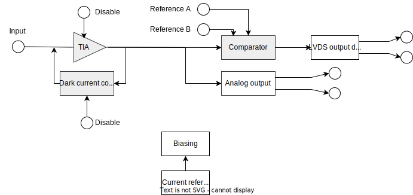
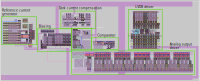
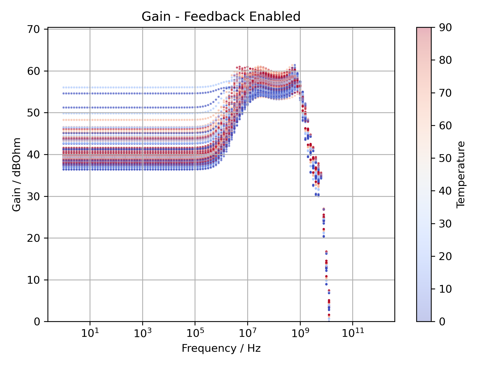
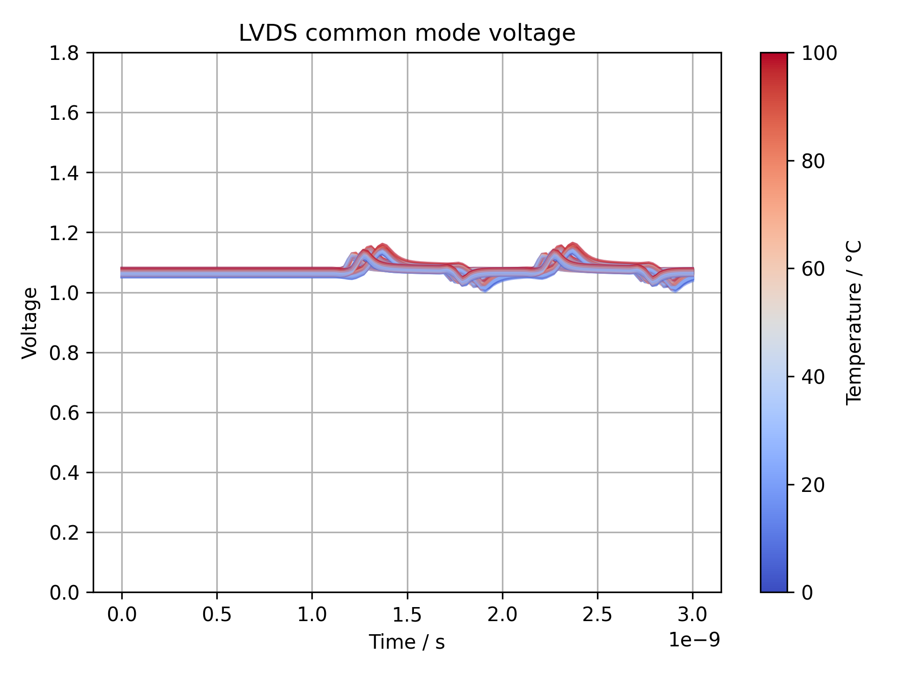
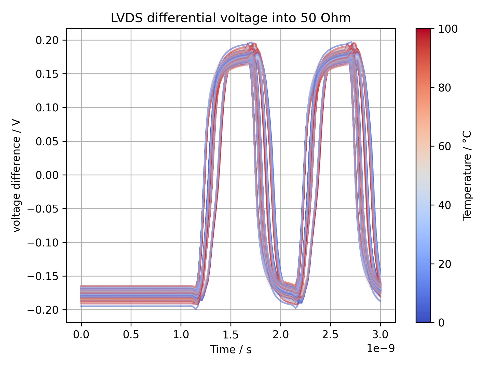

# Particle Detector Frontend
This is a simple analog frontend for detecting single particles such as cosmic rays, alpha or beta particles. The user can attach a detector, such as a silicon PIN diode to the input. When a particle hits the detector, it will create a current pulse. The current pulse is amplified by the transimpedance amplifier and detected by the comparator. The output of the comparator is made available as an low voltage differential signalling (LVDS) signal at the output and can be further processed by an FPGA, e.g. to count the number of inpinging particles per second.

The ASIC contains the following blocks:

The blocks are distributed in the layout as follows:

The overall bandwidth is intended to be approx. 1GHz. The design aims to enable the detection of pulses with a peak current of 5µA and length of 0.5 ns. To understand the functioninng of the circuit, have a look at the schematic xschem/test.sch and run the corresponding ngspice simulation. This simulation tests the circuit using a simple 5µA pulse.

The blocks are inteded to be re-used as IP blocks in future projects. Therefore for each block both schematic as well as a magic layout are available.

License:
  

—
## Biasing circuit and Transimpedance Amplifier
The Biasing circuit and TIA have been previously published and were submitted to the MPW-5. The documentation can be found here: [https://github.com/simonwaid/caravel_tia](https://github.com/simonwaid/caravel_tia)

## Active dark current compensation
The dark current of the detector may lead to saturation of the input TIA. To prevent this, an active dark current compensation circuit was implemente. The circuit is based on [1].

*Schematic:* xschem/tia/feedback_sukwani.sch
*Layout:* mag/feedback/fb_dark_current.mag

The overall gain with dark current compensation enabled is given in the following. Note that at low frequencies the gain is diminished due to the negative feedback of the dark current compensation.

## Comparator
The comparator is composed of saturation tollerant difference amplifiers stages. Each stage has a typical amplification of 10dB. By cascading 6 stages an overall amplification of approx. 60dB is attained. The threshold of the comparator is set by injecting an offset current into the 3rd difference amplifier stage. Prior to the 3rd aplifier stage, AC coupling eliminates the offset introduced by the previous amplifer stages. After the difference amplifer stages, a schmidt trigger is used to convert the differential analog signal to a single ended digital signal. The schmidt trigger contains a difference amplifer with a positive feedback making it bi-stable. The output of this difference amplifer is converted to a digitial signal via current mirrors and 3 cascaded inverter stages.

From a user perspective, the threshold is set via an input current on one of the two input pins. Supplying the current can be attained e.g. via a resistor or a current DAC.

*Schematic:* xschem/comp/comparator_complete.sch
*Layout:* mag/comp/comparator.mag

## LVDS driver
The implemented LVDS supports termination using resistors from 50 to 100 Ohm. By terminating using 50 Ohm a larger bandwidth can be attained. The following images shows the reaction of the driver to 1ns pulses. Note the different bunches of curves exhibiting a slight time shift. This is due to different process corners. Both the common mode voltage and the differential voltage remain stable over process corners, temperature and device mismatch. The common mode voltage ist set to 3/5 times the operating voltage which results in 1.08V at 1.8V operating voltage. This is slightly below the standard of 1.2V but results in a better performance in terms of speed.

*Schematic:* xschem/lvds/transmitter.sch
*Layout:* mag/lvds/transmitter.mag

## References
[1] [A high speed frontend electronics ASIC for multi-channel single gap RPC detector](https://doi.org/10.1088/1748-0221/16/07/p07042)